# Colecciones (Arrays dinámicos)

A la hora de almacenar elementos o cualquier objeto en un Array, nos hemos encontrado con un impedimento bastante curioso (al menos en Java) y es que los Arrays **son fijos** y no puede aumentarse su tamaño para así añadir más información en caso de requerirse.

Es por ello, que algún loco tuvo la idea de crear una especie de Arrays inteligentes, pero más que inteligentes deberíamos denominarlos como **dinamicos**.

Para poder crear un Array dinámico deberemos saber primero como funciona:

Nuestro Array dinámico o Coleccion va a ser un Objeto, como los que vimos anteriormente; dicho objeto tendrá sus atributos, constructor y métodos. Vamos a ir de uno en uno viendo cada una de sus partes.

#
### La estructura del objeto Collection

En caso de que quieras acceder, a algún método en específico para verlo con profundidad dejo un mini Índice aquí. En caso que quieras ver todo desde 0 te recomiendo que sigas el orden.

- Metodos de Colección
  - [Método insert()](#metodo-insert)
  - [Método delete()](#metodo-delete)
  - [Método search()](#metodo-search)
  - [Método getElement()](#metodo-getElement)
  - [Metodo getNumValores()](#metodo-getnumvalores)
  - [Método add()](#metodo-add)

Vamos a explicar un poco como funciona cada método, para posteriormente centrarnos en cada uno y resolverlo todo junto.

El nombre que va a tener nuestro objeto será *"CustomCollection"* (ya que cumple con la normativa de nombres que pudimos ver con anterioridad), este objeto tendrá varios métodos y atributos, además de su propio constructor.

Definiremos dos atributos:
- El atributo **datos[ ]** o **data[ ]**, el cual será un Array que se encargará de almacenar la información que queremos almacenar en nuestro objeto CustomCollection. Este Array almacenará **OBJETOS**, ya que como pudimos ver en el anterior apartado, **todos los objetos, heredan del objeto Object**, haciendo asi que todos los valores que utilizaremos (String, Integer, Float, Objetos creados por nosotros...) se podrán almacenar aquí. Dicho Array lo declararemos como ***nulo***. 
- El atributo **numValores** o **numOfValues**, que se encargará de decirnos cuantos valores tenemos dentro de nuestra CustomCollection. **¡OJO!**, este atributo cuenta los elementos que hayamos introducido, es decir, cuantos elementos hay dentro del array, **no el tamaño de este**.

***Ambos atributos serán privados***; Declararemos ambos atributos como en la siguiente imagen:

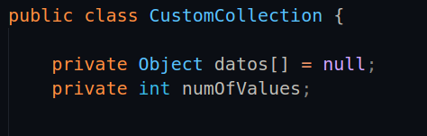

Una vez los tenemos, tenemos que declarar un constructor para nuestra colección, el cual recibirá como parámetro un valor que nos dirá el usuario. Deberemos preguntar por una capacidad inicial, para que se cree el primer Array en el que se basará nuestra clase.

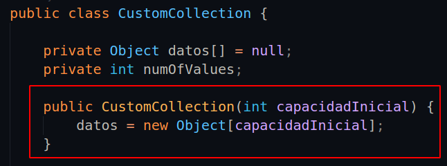

- El atributo que pasaremos es **capacidadInicial** o **initialCapacity**, esta variable que nos proporcionará el usuario, se encargará de decirnos con cuantos espacios queremos que se cree el Array una vez sea creada la colección.
- Tras de esto, el constructor tiene dentro una instanciación (es decir, está llamando a un Array de tipo Object), en el que ponemos como capacidad el valor que nos dice el usuario. 

También podemos crear un constructor que no reciba ningún parámetro, pero que cree un array con un tamaño que le pongamos nostros internamente, sin que el usuario lo sepa. Miremos el ejemplo:

He tapado el constructor que teniamos antes para que no hubiese confusión, pero igualmente podemos dejar ambos. Si queremos utilizar uno sencillamente pondremos una capacidad o bien podemos omitir este valor y dejar que nuestra clase cree la capacidad por si misma. 

Con esto ya tenemos el 20 % de nuestra clase hecha, ahora nos quedan los métodos con los que haremos que nuestra clase deje de ser un triste Array que no puede auto-extenderse y haremos que sea un Array dinámico. Los métodos que necesitaremos son los siguientes:

- Un método **insert( )**, que recibirá un parámetro de tipo Object (ya que como bien comentamos antes, lo hacemos para que podamos pasar el valor que queramos) y se encargará de introducir un valor en una posición del Array, pero con dos condiciones:
  - **Primera condición**: en caso de querer insertar un valor, en una posición en la que ya existe un valor, dicho valor no remplazará al ya existente sino que en su lugar los valores se rodarán para dejarle hueco al nuevo valor.
  - **Segunda condición**: en caso de que el Array esté lleno, es decir que el número de Objetos que se encuentran dentro sea igual al tamaño total de dicho Array; se deberá hacer más grande, es decir, deberemos hacer que se extienda más para que dicho valor pueda ser introducido.

Por otro, nuestro Array no trabajará con "espacios en blanco" entre los valores, es decir no podemos en un Array de 10 valores, un primer valor en la posición 0 y un segundo valor en la posición 5, ya que habrían 4 espacios entre medias. Esto más adelante lo solucionaremos, pero de momento lo tendremos así.

En caso de tener dudas vamos a ver un ejemplo sencillo.

> He creado un Array con un total de 5 posiciones, en dicho Array ya tengo 4 valores y quiero meter un décimo en la primera posición del Array (es decir, en la posición 0), pero claro ya tengo un valor en dicha posición ¿Cómo deberia de quedar mi Array en caso de yo poner mi valor?.

Imaginemos, que en el Array hay una serie de nombres (como bien indica deberían ser 4 nombres):

Y nosotros queremos hacer esto:

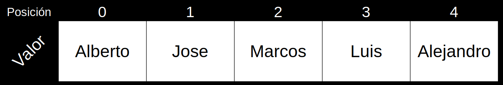

¿Qué es lo que ha pasado?, pues simple; los datos se han rodado de posición para poder dejar espacio al valor *"Alberto"*. Haciendo que el movimiento final sea algo como esto:

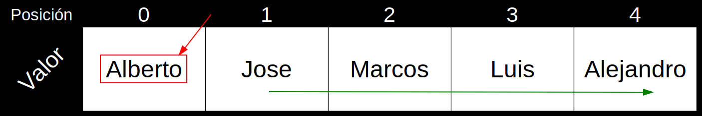

Esto es lo que deberá hacer nuestro método **insert ( )**. Pero claro, para hacer esto ***necesitará dos parámetros***, el parámetro que identificará al valor y otro que nos dirá en qué posición queremos que vaya; quedandonos así el método:

    insert(Object elemento, int posicion) {
      [...]
    }

Evidentemente, al añadir una posición más deberemos sumar uno a nuestro número de valores.

- Se necesitará también un segundo método llamado **delete( )**, que se encargará de eliminar un valor según una posición que será proporcionada por el usuario. Como en el caso anterior, tenemos que cumplir una condicion:
  - **Condición**: en caso de que borremos un dato, que tenga datos a su alrededor, tendremos hacer que el hueco sea rellenado por los datos que se encuentran detrás de la posición del dato que hemos borrado.

Pongamos de nuevo el Array que teniamos antes, justo cuando habiamos añadido el nombre de *Alberto*; imaginemos que queremos borrar al usuario Marcos:

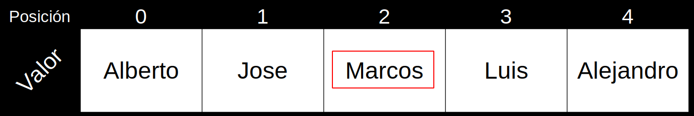

Si lo borramos como hemos hecho hasta ahora (que realmente no se puede borrar, si no que sencillamente se pone en *"null"*), debería de quedarnos el Array algo así:

Pero **no es esto lo que nos piden**, o al menos no es lo único, si no que queremos que los datos que hayan a la derecha pasen a este nuevo lugar y rellenen el espacio en blanco. 

Pero claro, si nosotros en lugar de borrar directamente el dato, utilizasemos el valor que viene después, en este caso *Luis*, para escachar a *Marcos* (no escacheis a la gente pls) estariamos también borrando el dato ¿verdad?, realmente remplazandolo pero sería lo mismo conceptualmente:

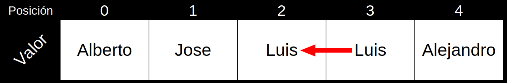

Entonces, si después de Luis viene alejandro, el resultado final debería ser algo así:

Pero claro, ahora nos queda un valor repetido que no queremos, pero si nos damos cuenta, el número de Valores que teniamos nosotros es 5 (antes de que borrasemos a marcos), pero el Array no lee las posiciones como las hacemos nosotros, si no que en su lugar **le resta un valor, ya que empieza en 0**. Pues utilizando el atributo del número de valores, podemos borrar el valor repetido de la última posición, poniendo un null en su lugar, con una instrucción tan fácil como la siguiente:

    datos[numValores - 1] = null;

Con esto, borraremos el dato *Alejandro* repetido de la última posición de nuestro Array. 

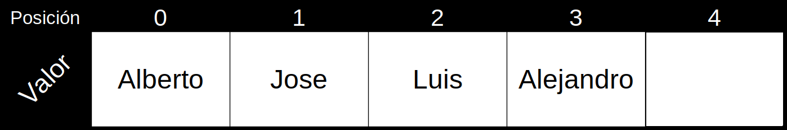

A su vez, como ocurría con insert que al añadir un dato, tendría que sumarse un valor, en el caso de delete sería lo contrario:

    datos[numValores - 1] = null;
    numValores--;

- Por otro lado, queremos un método **add( )**, que se encargará de añadir un valor en la última posición de nuestro Array (y como ocurría con el método insert, en caso de no haber espacio pues que se cree más). Para este punto, lo ideal es haber realizado el método insert, ya que si sencillamente queremos insertar un valor más le decimos que se situe siempre en el último; ¿y que valor tenemos ya que nos diga cual es la última posición disponible?, simple, el atributo *numValores*, ya que para el Array, equivaldría en la última posición válida. 

      public void add(Object elemento) {
          insert(elemento, numValores);
      }

Sigamos con el caso anterior, tenemos 4 valores:

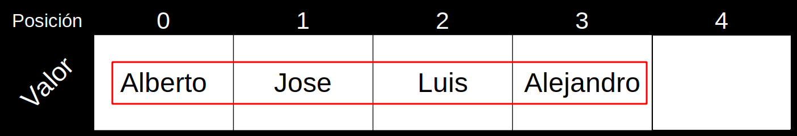

Si nos fijamos, la siguiente posición es la posición 4 y nuestra variable numValores, nos dice que tenemos 4 valores; por eso la utilizamos, porque nos indica la posición siguiente.

- Lo siguiente que queremos es un método **search( )** que se encargará de buscar el elemento que nosotros estamos buscando en el Array, y en caso de no encontrarlo nos devolverá *-1*, tan simple como eso.
- Por último, pero no menos importante el método **getElement( )**, que nos devolverá el elemento que se encuentra en la posición que nos pase el usuario al llamar a este método.

Sin más dilación vamos a ponernos a trabajar, empezaremos por los métodos **insert** y **delete**.

#
#### Metodo insert

Vamos a empezar pues por el método insert:

En primer lugar lo declararemos en nuestro código siguiendo los parámetros que se nos piden y estos otros:

- El método será público, ya que queremos que los usuarios puedan utilizarlo.
- No devolverá ningún valor, por lo que será un ***void***.
- Recibirá dos parámetros del usuario, un elemento y una posición.

Dicho esto, podriamos decir que una estructura correcta sería la siguiente:

    public void insert(Object elemento, int posicion) {
      [...]
    }

Lo primero en lo que tendremos que pensar cuando vayamos a introducir un dato, es en si tenemos espacio suficiente, ya que si no tenemos espacio suficiente de poco nos sirve el Array dinámico.

En la condición se añadió un array nuevo, lo llamaremos "auxiliar"; dicho array servirá unicamente, para hacer una copia del Array original (datos[ ] o data[ ] como lo hayais llamado).

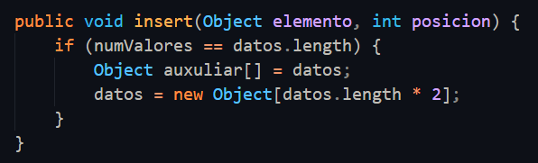

Y como podemos ver, justo después al tener ya una copia de los datos que teniamos, podemos remplazar el Array anterior con uno nuevo **que encima es más grande** que el anterior (concrectamente el doble).

La sintaxis que podemos ver, es exactamente la misma que la vista en el constructor, con la diferencia de que estamos creando un Array nuevo, el doble de grande. Aun así, aun no hemos terminado, tenemos que meter los datos del Array auxiliar en el nuevo Array, para ello haremos un bucle *"for i"* sencillo que se encargará de poner los datos en el nuevo Array, evidentemente tenemos datos que nos pueden facilitar esta tarea, uno de ellos es el *numValores* por ejemplo, que nos dice cuantos datos tenemos guardados en auxiliar:

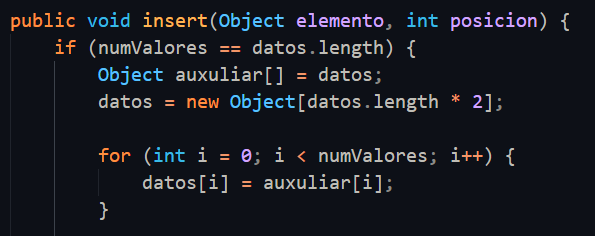

Ahora necesitamos hacer, que en caso de querer añadir un valor en una posición que ya esté ocupada, el valor sea añadido en la posición en la que se pretende, pero los otros valores deberán moverse, para esto usaremos otro bucle *"for i"*. 

Este bucle tendrá un funcionamiento bastante diferente al que podemos estar acostumbrados, ya que actuará para cumplir lo que habiamos planteado al inicio:

Tenemos que conseguir un bucle, que nos sitúe los nombres de tal manera que no se pierda ninguno, pero ¿como?. Volvamos a el primer ejemplo que vimos:

Si nos fijamos, tenemos 4 valores; en caso de nosotros querer meter un valor más, por ejemplo en la posición 0, si no tenemos nada preparado, se nos meterá el nombre y nos escachará a Jose, y no queremos que nos escachen a Jose. Para evitar esto, deberemos mover primero los nombres una posición a la derecha:

- **¿Por qué una posición?:** porque hemos diseñado nuestro Array para que se nos introduzca un único valor.
- **¿Por qué a la derecha?:** porque los Array no trabajan con números negativos, por lo que al intentar mover los nombres a la derecha, nos saldremos de nuestro Array.

De esta manera nos evitamos problemas, y así entederemos mejor este concepto, que en realidad es más simple de lo que pueda parecer.

El objetivo que perseguimos es que los nombres que queremos que se muevan, aparezcan como en la siguiente imagen:

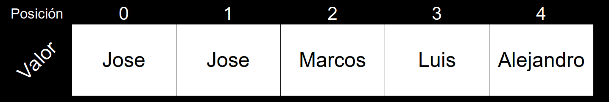

Como podemos ver, en la posición 0 y en la siguiente hay dos Joses, porque queremos que en la posición 0 se introduzca nuestro nuevo valor; vamos a verlo mejor en el código:

Creamos un bucle for, dicho bucle for tendrá los tres campos que siempre tiene, una variable que contará en el bucle, que si cumple la condición que se propone será alterada segun  (bien sea, sumando o restando, Ojo con esto). Haremos esto:

Crearemos la variable (que nombraremos como queramos, siempre y cuando no esté siendo utilizada en el mismo *scope*) que se encargará de contar en el bucle. Esta variable la asignaremos con la condición de que sea el valor del número de valores **menos 1**. 

Pero ¿Por qué?, volvamos al dibujo mental en el que el Array está intacto. Queremos mover los datos de tal manera que no los perdamos, haciendo que dejen un hueco para el nuevo valor. 

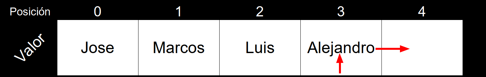

Para ello deberemos empezar en el último valor que tenemos, en este caso el que se encuentra en la posición **3:** *Alejandro*, **¿y cuanto es 4 - 1?** , exacto **3**, la posición de nuestro último valor. Es por esto que estamos empezando aquí, porque vamos a ir moviendo estos valores a la derecha; y si eres rápido recapacitando probablemente te hayas dado cuenta ya, pero este for es un for *invertido*, en lugar de sumar vamos a restar esta variable para que vaya moviendo cada valor a la posición del siguiente, como se puede ver a continuación:

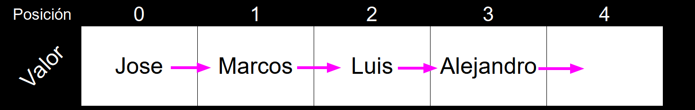

Ahora, veamos la condición; dice, que mientras la variable anterior (que en el primer momento es 4) **sea mayor que la posición en la que vamos a poner nuestro dato**, es decir 0 en este caso, se vaya **restando de uno en uno** (para que vaya moviendose hacia la izquierda). No es nada del otro mundo, sencillamente mientras la variable no haya llegado al punto en el que queremos poner nuestro valor, que no pare.

Y por último, en cada vuelta que da el for, lo que hará internamente es añadir en la posición que está libre (osea donde no hay peligro de perder ningún nombre)

Ahora, nos queda hacer que cuando añadamos un valor nuevo, se ponga en la posición que queremos y se sume uno a nuestro atributo de numero de valores:

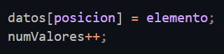

Ahora con todo esto, nuestro método hará algo como lo que deciamos en el ejemplo de antes.

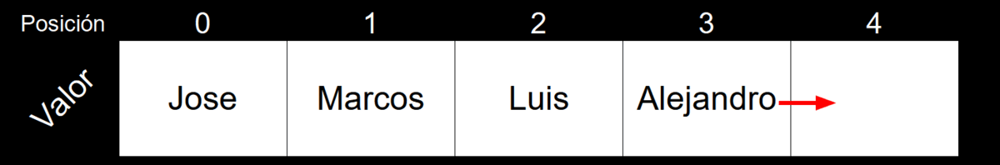

Por si lo necesitas, este es el código completo del método.

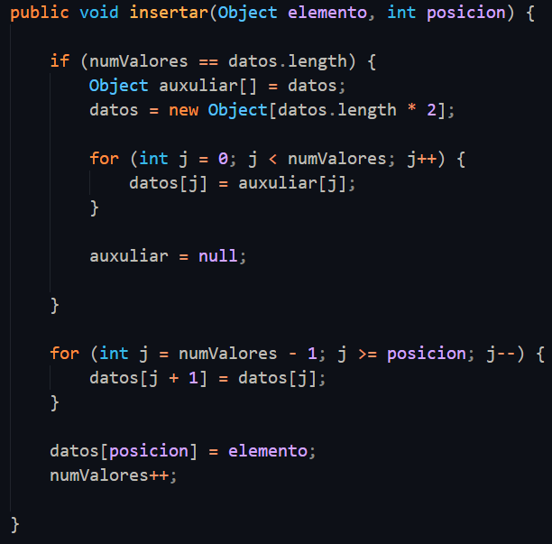

#
#### Metodo delete

El método delete será prácticamente lo mismo que el método insert, con la diferencia clara de que en lugar de añadir un valor, lo exterminará.

La diferencia más significativa respecto al insert (ignorando funcionamiento, que es evidente) es que este método **si devuelve a un valor**, más que nada por tradición; el valor que devolverá es el que se ha borrado, por si el usuario quiere utilizarlo para algo. Por último que debemos saber antes de ponernos con este método, es que se deberá declarar la posición en la que se borrará el valor; dicho esto podemos empezar.

Lo primero que tenemos que hacer es crear el método, para ello tendremos que declarar lo siguiente:

- Que sea público.
- Que devuelva un valor
- Y que se le pase como parámetro una posición.

Sabiendo esto, solo deberemos poner una estructura parecida a la siguiente:

    public Object delete(int posicion) {
      [...]
    }

**RECUERDA:** no pasa nada por poner el mismo nombre de parámetro que tiene otro método, ya que están separados entre si por lo que denominabamos como *scope*, ten encuenta esto para todo tipo de actividades.

Lo primero que deberemos declarar, es la variable auxiliar que se encargará de almacenar el valor que vamos a devolver al final de nuestro método. Este valor será igual a el valor que se encuentre en el array de datos según la posición que nos dieron; algo asi:

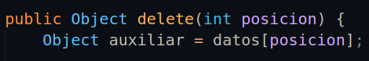

Con esto, nos aseguramos que el valor se encuentra a salvo y seguro, para poder nosotros escachar el que se encuentra en el Array de datos (recuerdo, por favor, no escacheis cosas):

Para poder ahora hacer lo que nos pide el método necesitamos si o sí un bucle, ya que deberemos recorrer valores. Usaremos un bucle for, que de una manera parecida a lo que hacía nuestro bucle para el método insert, recorrerá el Array para poder cumplir con lo que se nos pide.

El bucle tiene la siguiente estructura:

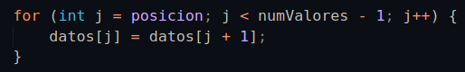

Vamos a destriparla (metafóricamente hablando por supuesto):

Primero, creamos la variable *j* , que inicialmente será igual a **la posicion del valor que se nos ha dado**, por ejemplo, si queremos borrar como dijimos antes al valor Jose, su posición sería la posición 1 en el array.

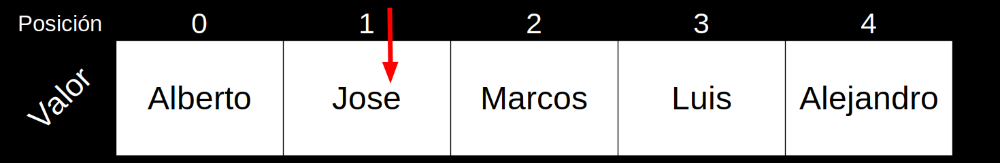

Tras de esta declaración, se nos pone la condición de que mientras la variable *j*, sea menor que el número de valores que tenemos (en este **ejemplo serían 5**), que vaya aumentando el valor. 

En caso de cumplirse la condición anterior, aparte de sumar el índice del bucle, tenemos una condición que se cumple con cada vuelta que damos, y es la de que el valor que se encuentre en la siguiente posición respecto a la que nos encontramos ahora. Básicamente se hará lo que vimos anteriormente:

Y solo nos quedaría devolver el dato, no sin antes decir que hemos quitado uno, para ello declararemos lo siguiente:

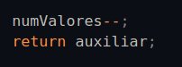

> Y ahora, aprovechando que volvemos a tener un valor auxiliar hay que comentar algo medianamente importante. Si recordamos, en el anterior ejemplo (en caso de habernos fijado) en el código ponemos esto para borrar el Array auxiliar (ya que no lo utilizaremos más una vez tengamos el que es más grande): 
>
>

>
>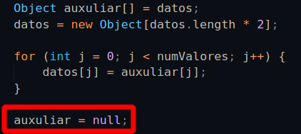
>
>

>
> Esto lo hacemos para poder aligerar la memoria, evidentemente la cantidad que tenemos ocupando es ridículamente pequeña pero no deja de ser una buena práctica. Igualmente, no hay que preocuparse por esto al menos en Java, ya que el compilador se encarga de hacer esto por nosotros pero con cosas como estas facilitamos al compilador el hacer el trabajo. 
> 
> Evidentemente en el caso del delete, no podemos hacer esto ya que perderíamos irremediablemente el dato que queremos pasar al usuario

Con esto ya tendremos completado el método **delete()**; aquí el código:

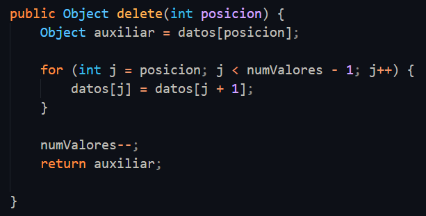

#
#### Metodo search

El siguiente método que vamos a ver, es el método **search()** el cual se encargará de devolver un valor según lo que introduzcamos en la casilla, es decir si por ejemplo escribo *"Alberto"*, me devolvería la posición en la que se encuentra.

Para esto por suerte, tendremos en cuenta que si nos piden un valor que no existe, devolveremos una posición imposible: **-1.**

Empecemos pues con el código. Lo primero será darle un permiso similar al de los dos anteriores métodos, es decir, *public* que devolverá una posición y recibirá cualquier cosa como parámetro (*número, texto, objeto...*). Con esto ya estructurado, podemos decir que el método tendrá de forma inicial una forma como la siguiente:

    public int search(Object elemento) {
        [...]
      }

Este método es bastante simple, haremos que según los valores que tenemos en nuestro Array sean recorridos por un for que irá comprobando posición a posición si el elemento que encuentra es el que se nos pide o no.

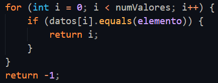

En caso de encontrarlo, devolverá la posición sin problema, y en un caso opuesto devolverá **-1.** Como podemos ver, no es mucho código, y los que vienen después no son una excepción.

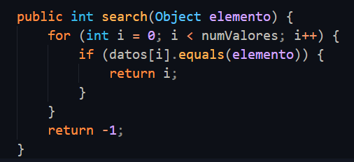

#

#### Metodo getElement

Este elemento es muy parecido al anterior, con la diferencia de que en lugar de cojer una posición, devolverá el elemento en cuestión. A este método no se le pasará si no la posición que queremos encontrar, por lo que podemos decir que su estructura es algo así.

    public Object getElement(int posicion) {
      [...]
    }

Y espera no te vayas muy lejos, porque el código final es tan simple como esto:

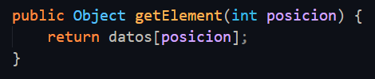

Si, como bien dijimos no vamos a filtrar los datos que no existan o los números negativos, por lo que no tiene mucha dificultad.

#

#### Metodo getNumValores

El siguiente método nos devolverá el número de valores que tenemos en nuestra Colección, tampoco tiene mucha dificultad, este es el código:

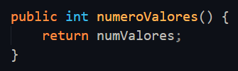

> Recuerda, numValores es el atributo que tiene la colección asignada para poder saber cuantos elementos tenemos dentro del Array (independientemente de cuanto sea su tamaño final, solo representará las casillas ocupadas por valores)

#

#### Metodo add

Por último nos queda el método add. Este método se encargará de añadir **SIEMPRE** un valor que sea introducido por el usuario, por la última posición de los valores creados, es decir; en caso de tener un total de 3 valores en un Array de 5, el método add() añadirá el valor que nosotros le pasemos en la siguiente posición (en el array esta posicion sería la 3a) veamoslo con calma en el siguiente gif.

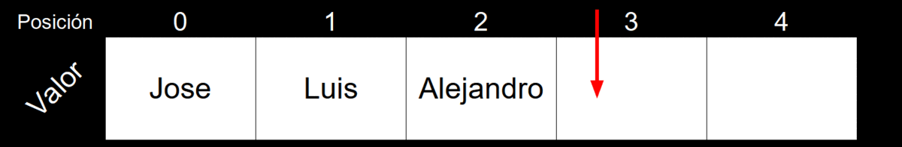

Pero una cosa, ¿no tenemos ya un método que siempre añade un valor en la posición que queramos y que encima crea un Array nuevo cada vez que se llena el anterior?, pues si, el **método insert** ya cumple con esta acción.

Es por eso que toda la gracia de este método se encuentra en reutilizar el código que previamente creamos, haciendo que nuestro método add quede así:

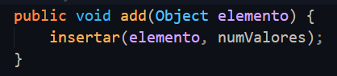

Y con esto ya habremos creado nuestra clase CustomCollection, si necesitas acceder al archivo en cuestión, está en el siguiente enlace: 

**Aquí** :arrow_right: **[ [link](Ejemplos/9%20-%20Colecciones/CustomCollection.java) ]**

 

[:arrow_backward: Anterior punto](0%20-%20Indice.md)  
[Siguiente punto :arrow_forward:](0%20-%20Indice.md) 

#

**[Indice Java :house:](0%20-%20Indice.md)**