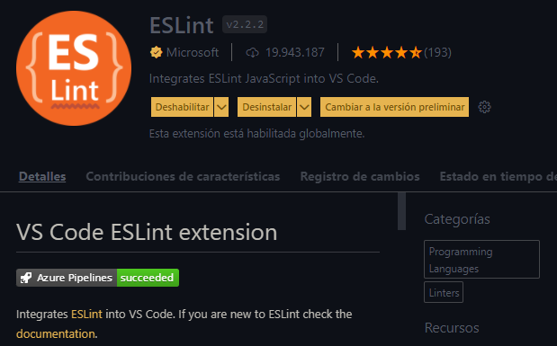
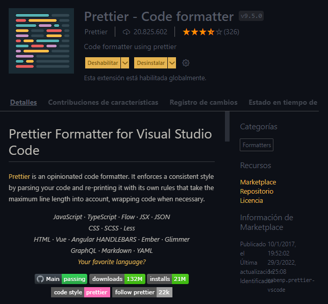
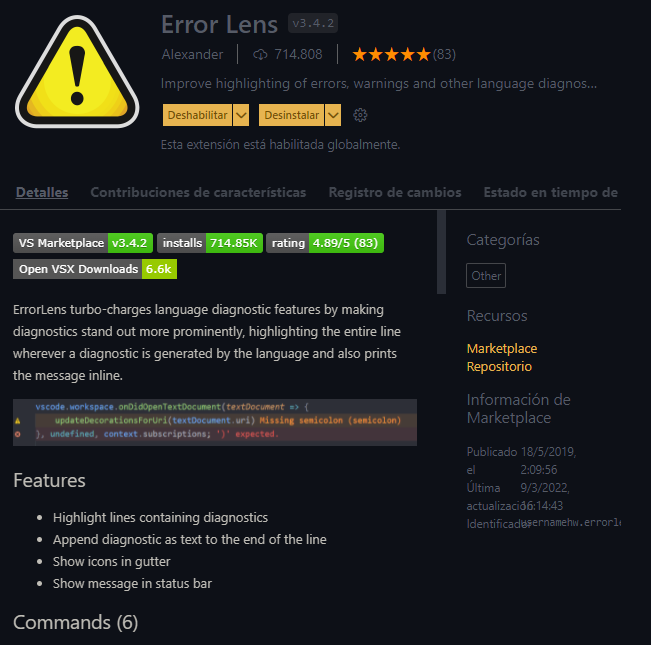

## Configurando el editor

Para poder utilizar React deberemos preparar cosillas antes de empezar.

- Lo primero, deberemos de instalar *Visual Studio Code* - realmente no es obligatorio, pero es muy recomendado ya que es gratis y es el editor de código más utilizado:
  

<strong>Enlace de descarga:</strong> <a href="https://code.visualstudio.com/download">https://code.visualstudio.com/download</a>

 

- Lo segundo es, una vez instalado nuestro editor de código deberemos seguir una serie de pasos para no perder el ritmo, ya que los realizaremos de una manera en concreto. Igualmente no te preocupes, todo quedará pautado y bien escrito en este documento.

> **Nota:** El proceso se realizará con el editor que se menciono anteriomente, en caso que algún paso no sea posible desde tu perspectiva, tendrás que omitirlo irremediablemente.

#### NodeJS

**1.** Lo primero que deberemos hacer es decargar e instalar NodeJS, para ello deberemos irnos al siguiente enlace: **[https://nodejs.org/en/](https://nodejs.org/en/)**.

Para comprobar que lo tenemos correctamente instalado la opción más correcta es dirigirnos a un terminal y escribir:

        node -v 
        
        Posible resultado: v16.14.2
    
Esto como habrás podido observar devuelve la versión que acabamos de Instalar no hace mucho. 
     

**2.** Una vez tengamos node preparado deberemos es instalar una serie de plugins de Visual Studio Code, a continuación los listaré con su correspondiente nombre y una aprencia previa. No hay que seguir ninguna clase de orden para instalar estos plugins, pero si deberás tenerlos ya preparados.

#### Plugins

  - Plugin de Microsoft: **ESLint** 
     

    

    

    

  - Plugin de Prettier: **Prettier - Code formatter**
     

    

    

    

  - Plugin de *Alexander*: **Error Lens**
     

    

    

    

Este procedimiento lo tendremos que hacer únicamente una vez para nuestros proyectos de React (por dispositivo claro está). Es por ello que para no tener una confusión, iremos ahora al apartado de *"Mi primer proyecto"* en donde veremos los pasos que deberemos hacer cada vez que queramos crear proyectos con ReactJS.

 

[:arrow_backward: Anterior punto](1%20-%20Que%20es%20React.md) 
[Siguiente punto :arrow_forward:](3%20-%20Mi%20primer%20proyecto.md)

#

**[Indice ReactJS :house:](./0%20-%20Indice.md)**