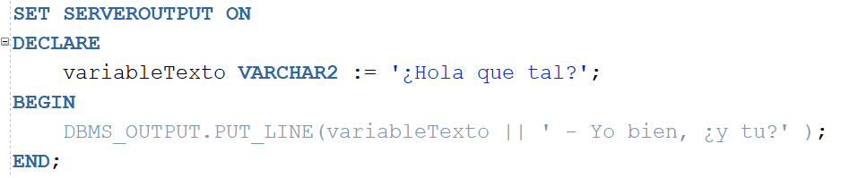

## Instalacion de Oracle

Para poder trabajar con PL/SQL lo haremos desde Oracle DB, y para esto tenemos que tener sus herramientas; pero claro, hay dos formas desde las que podremos utilizar esta herramienta, una es mediante una máquina virtual ya creada y otra desde una instalación en un equipo propio o el que nosotros queramos:

1. Importar la máquina virtual **oficial de Oracle** en la que se encuentra todo ya hecho. El enlace de descarga se encuentra en el siguiente enlace: <a href="https://www.oracle.com/downloads/developer-vm/community-downloads.html">Máquina virtual con Oracle instalado</a>. 
    

   Deberemos comprobar las instrucciones para saber la contraseña y los datos de usuario (por defecto, la contraseña y usuario para todo si no ha cambiado es: **oracle**, salvo evidentemente en los usuarios de la base de datos porque ya están estipulados de base.) Si necesitas una guía para usarla aqui tienes otro enlace: <a href="https://www.dontesta.it/en/2022/01/09/how-to-use-oracle-database-19c-pre-built-developer-vm/"> guía</a>. Ya luego veremos como utilizar la herramienta. 
     

2. O bien, podemos instalar estas utilidades por nosotros mismos en nuestra máquina (no es recomendable pero es una posibilidad). Para esto tendremos primero que dirigirnos <a href="https://www.oracle.com/es/database/technologies/oracle-database-software-downloads.html">aquí</a> para ver las características mínimas y máximas para nuestro S.O 

> Aviso que en todas las distros de Linux no se puede instalar, salvo en aquellas derivadas de RedHat, ya que sobre todo está preparada para la distro de Oracle Linux.

El procedimiento de instalación lo puedes comprobar en la siguiente tabla (para cada S.O):

|Sistema Operativo|Link de guía|
|---------------------|-----------------------------------|
|Windows 7 | <a href="http://www.rebellionrider.com/how-to-install-oracle-database-21c/">Instalacion en W7</a>
|Windows 10| <a href="http://www.rebellionrider.com/how-to-install-oracle-database-21c/">Instalacion en W10</a>|
|Linux | <a href="https://www.centlinux.com/2021/12/install-oracle-database-21c-on-rhel-8.html"> Instalacion en RedHat y derivadas</a>|
|MacOS| <a href="https://www.databasestar.com/oracle-mac/"> "Instalación" en MacOS |

> Como habrás podido comprobar en caso de acceder al enlace de MacOS, para "instalar" la base de datos deberás utilizar la máquina virtual que habiamos comentado en el primer apartado, es realmente la mejor alternativa y la única en el caso de Mac y los S.O que no pueden permitirse instalar Oracle DB.

#### La estructura de PL/SQL

La estructura de PL/SQL no es como la de los lenguajes de programación que hemos visto hasta ahora, en su defecto es un lenguaje simplon pero no por ello quiere decir que sea fácil, sencillamente es más limitado a su uso dentro de las bases de datos de Oracle. 

Este lenguaje contiene elementos que **si hemos visto**, lo que ocurre es que no funcionan de la misma manera que con los otros lenguajes.

Lo que deberemos tener en cuenta es al menos la estructura base de nuestro código; si nosotros queremos programar una instrucción, de momento lo haremos en un espacio al que denominaremos **bloque de instrucciones**, en el que según la estructura que veremos a continuación, el código será introducido.

Existen varios cuatro de bloques, nosotros nos centraremos y haremos de momento todos los ejemplos en el primer tipo de estos:

- Bloques **Anónimos** *(Anonymous Blocks)*: Estos bloques se construyen de manera dinámica y solo son ejecutados una única vez.
- Bloques **con nombre** *(Named Blocks)*: estos bloques son igual que en el anterior caso; se construyen, generalmente, de forma dinámica y se ejecutan una sola vez.
- **Subprogramas**. Son procedimientos, paquetes o funciones almacenados en la BDD (Base de Datos). No suelen cambiar después de ser construidos, ya que existen para ejecutar acciones repetitivas o funciones que nunca variarán
- Luego también existen los **Disparadores** (Triggers). Los cuales son bloques con nombre que también se almacenan en la BDD y que tampoco suelen cambiar tras ser creados. La diferencia erradica en que estos bloques son ejecutados tras transcurrir un evento que ha sido determinado en el propio bloque que se va a ejecutar, este evento suele ser una orden del lenguaje de manipulación de datos (DELETE, INSERT o UPDATE) que se ejecuta sobre una tabla de la BD.

Los bloques (los dos primeros que vimos anteriormente) poseen una estructura específica compuesta de varias partes diferenciadas y con su propia funcionalidad:

- **Sección declarativa**: Aquí será donde se declaran todas las variables y constantes que pertenecen al bloque en cuestión. Esta sección es completamente opcional.
- **Sección de ejecución**: Esta es la opción más importante del bloque, ya que es donde todas las acciones que queramos transmitir serán ejecutadads. Dichas instrucciones pueden ser tanto DDL como DML, así como ordenes de subprogramas (como procedimentales). Evidentemente, es una sección obligatoria.

Existe también la **sección de excepciones**, pero al tener estas su propio apartado lo dejaremos hasta ese punto.

Otra cosa a tener en cuenta es que las variables se declaran con el símbolo de los dos puntos seguidos del igual (**:=**) en lugar de utilizar del símbolo igual como llevamos haciendo hasta ahora.

#

###### Ejemplo de código

Dicho lo anterior, un pequeño ejemplo de código podría ser el siguiente:

    

La instrucción que vemos en el apartado de ejecución (BEGIN),  *DBMS_OUTPUT.PUT_LINE(variableTexto)*, nos muestra el valor que nosotros pongamos entre paréntesis y con las tuberias "*||*" concatenan con lo que pongamos después (más o menos como el funcionamiento del System.out.println(); en java). Esta instrucción **necesita de la primera linea** para funcionar, de no ser así no se moestrará nada por pantalla.

Dicho esto, ya podemos empezar a ver los tipos de datos que nos podemos encontrar además la realización de bucles y las funciones que vimos con MySQL.

 

#

[:arrow_backward: Anterior punto](0%20-%20Introducción%20a%20Oracle%20y%20PL%20SQL.md)  
[Siguiente punto :arrow_forward:](2-%20Tipos%20de%20datos%20y%20Operadores.md)

**[Indice Bases de Datos :house:](../0%20-%20Indice.md)**